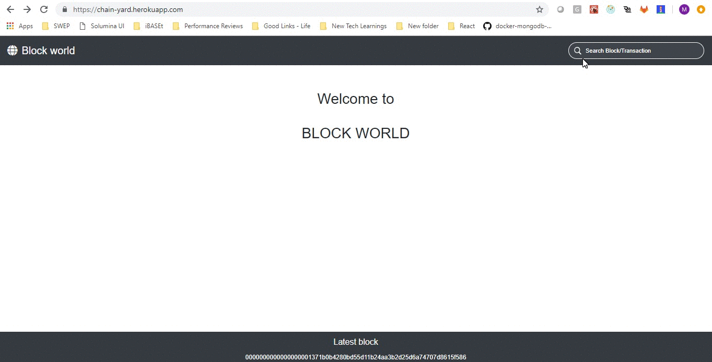

# block-world

This is a application that allows to browse through real blocks & transactions of the Bitcoin blockchain. Some of the things that i learnt developing this app include
- Redux-promise-middleware
- Redux-thunk
- React Bootstra
- Developing responsive sites for devices of different size
- Adding SASS to create react app

Other tech used include, ReactJS, Redux, React router

## Sandbox URL
https://codesandbox.io/s/4w0504473x

## Deployed at
https://chain-yard.herokuapp.com

## App Demo

